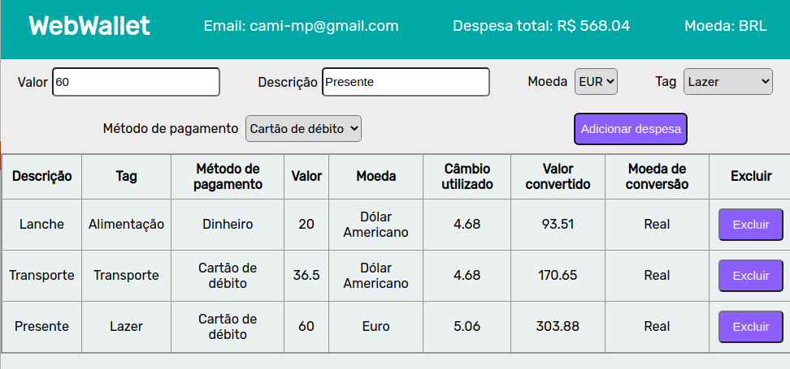

# Boas vindas ao repositório do projeto WebWallet!

Visualize e teste a aplicação clicando <a href="https://camila-mp.github.io/webwallet">aqui</a>.

# Sobre

Projeto desenvolvido individualmente durante o curso da Trybe, no módulo  Front-End. Ideia geral de funcionalidades vieram da Trybe, enquanto eu desenvolvi todo o código (React, JSX, HTML e CSS).
A aplicação simula uma carteira de controle de gastos com conversor de moedas. A conversão é atualizada com consumo de dados da API <a href="https://docs.awesomeapi.com.br/api-de-moedas"> *awesomeAPI - Cotações de Moedas*</a>. Ao utilizar essa aplicação, o usuário pode:

- Adicionar ou remover despesas em diversas moedas;
- Visualizar uma tabelas com seus gastos;
- Visualizar o total de gastos convertidos;

# Tecnologias utilizadas

`HTML`, `CSS`, `JavaScript`, `React`, `React router` e `Redux`.

# Como rodar o projeto na sua máquina

Abra o seu Visual Studio code e siga as instruções a seguir.

1. Clone o repositório com o comando:
`git@github.com:camila-mp/webwallet.git`

2. Entre na pasta clonada:
`cd webwallet`

3. Instale as dependências com:
`npm install` ou `yarn install`

4. Inicialize a aplicação no servidor local:
`npm start` ou `yarn run start`
